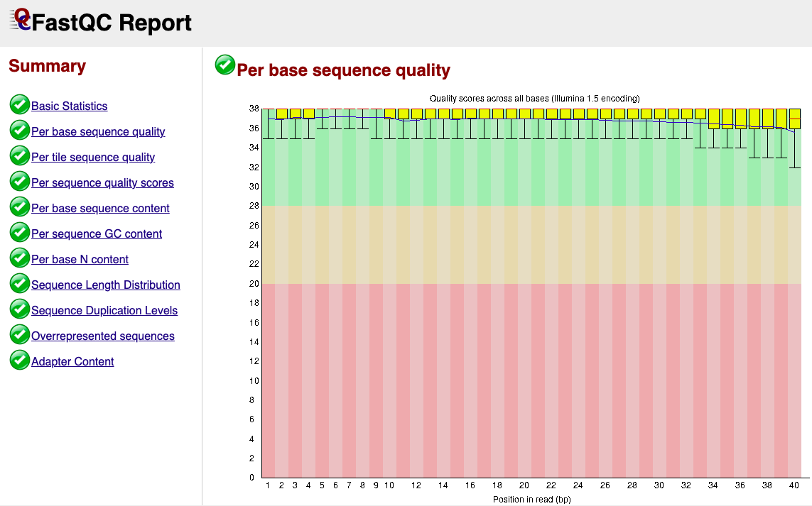

```{r setup, include=FALSE}
knitr::opts_chunk$set(echo = TRUE)
```

## R Markdown

This is an R Markdown document. Markdown is a simple formatting syntax for authoring HTML, PDF, and MS Word documents. For more details on using R Markdown see <http://rmarkdown.rstudio.com>.

When you click the **Knit** button a document will be generated that includes both content as well as the output of any embedded R code chunks within the document. You can embed an R code chunk like this:

```{r cars}
summary(cars)
```

## Including Plots

You can also embed plots, for example:

```{r pressure, echo=FALSE}
plot(pressure)
```

Note that the `echo = FALSE` parameter was added to the code chunk to prevent printing of the R code that generated the plot.

# Filtering and Trimming .fastq reads

[**Note:**]{.underline} This step comes after **demultiplexing**, a step that splits a big **.fastq** file containing all reads of a single sequencing run (with reads comming from different samples all mixed in together) into **separate .fastq files**, each one containing sample-specific reads and/or either forward/reverse reads. Demultiplexing can be done in multiple ways (QIIME2, bash tools, etc). However, this processing step is typically done by the sequencing facility, so it will not be covered on this small course. For more info on this step (demultiplexing), visit [this demultiplexing tutorial (tool: Sabre)](https://astrobiomike.github.io/amplicon/demultiplexing){.uri} or ...

## Overview

There is an ubiquous **filtering** and **trimming** process applied to DNA/RNA sequencing reads (.fastq files) that aims at obtaining clean .fastq reads, by elimination, trimming and filtering of **raw sequencing data**. *You can think of this process as a way of eliminating "noise" and obtaining a clearer signal than the raw output by the sequencing machine.*

Each read is analysed for it's **quality**. This is informed by the overall read length as well as by the quality of each nucleotide (in Casava .fastq format this is informed by the **Phred score**) and **primers** are removed (**trimmed**).

In this course, we will focus the **quality analysis** on reads produced by **Illumina** **pair-ended sequencing machines (Mi-Seq, etc)**.

### Tools

**FastQC** (*bash CLI*): **Q**uality **C**ontrol of reads in a **.fastq** file ([link](https://www.bioinformatics.babraham.ac.uk/projects/fastqc/){.uri}).




**MultiQC** (*bash CLI*): combines multiple fastqc quality analysis into one interactive, easy to read .html file ([link](https://seqera.io/multiqc/)).

[ADD IMAGE]

**Cutadapt** (*python*): will search for and trim primer sequences in the reads, as well as trim based on nucleotide quality, length, etc. [Note:]{.underline} Although the cutadapt tool runs on *python*, in this tutorial it will be implemented within an *R script.*

[IMAGE]

### Steps

1.  Initial Quality Check -\> *FastQC + MultiQC*

2.  Primer Trimming -\> *Cutadapt* (*within* *R)*

3.  Read Quality Trimming and Filtering -\> *dada2::filterAndTrim()* \~ similar to cutadapt

## Code

[Note:]{.underline} the following commands are optimized for use on the **EEG bioinformatic's linux machine**, since all the necessary programs are already installed and working. If working on another machine: set-up a conda environment with the necessary python version and the programs (fastqc, multiqc and cutadapt), like shown here [link].

### 1. Initial QUALITY Check 

```{bash}
#[bash CLI on EEG's bionformatics machine]

# Listing the available conda environments
conda env list
```

```{bash}
# Activating the 'metatax' conda environment
conda activate metatax
```

```{bash}
fastqc --help # have a quick look at the tool's parameters

Fastqc -o [PATH] \\ # specify PATH to output's folder
        


```

[Note:]{.underline} Although this step is marked sequentially as a first step, it is a good *praxis* to keep on checking on read's quality and length as we go on the filtering and trimming process. Visualizing and interpreting the read quality plots will ensure the process is working as intended.

### 2. PRIMER Trimming with Cutadapt

In this step, we will specify the **primer's** **sequences** (both *forward* and *reverse*). These sequences are typically known via prior knowledge during DNA extraction/library preparation and are usually specified within the sequencing report.

The following script will parse all sequences and count the number of primers found. This "primer check" will also be done after running cutadapt, to see if, in fact, primers were removed. Because of how PCR works, we will have to look for **reverse**, **complement** and **reverse complement** sequences of primers.

[IMAGE of primers after PCR]

```{r}
cut.path <- "~/"
```

### 3. Read Quality Filtering and Trimming

```{r}

```
